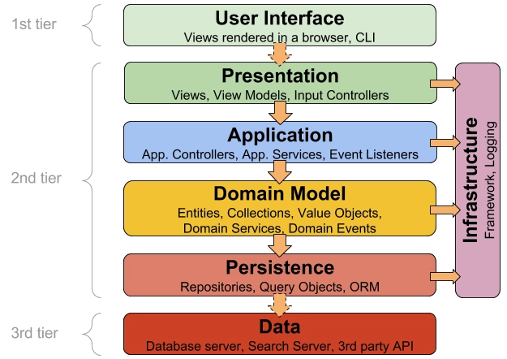
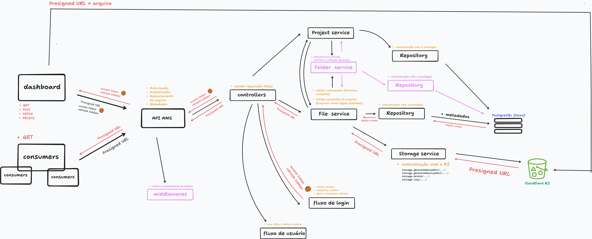

# AMS (Asset Managment System)

## Visão geral:

- Sistema privado desenvolvido para armazenar e gerenciar os assets dos meus projetos, como imagens, vídeos e outros arquivos utilizados para documentação e apresentação. Após a conclusão de um projeto, seus materiais visuais são organizados e armazenados no AMS, tornando-se uma fonte centralizada para consumo por outras aplicações, como meu portfolio, por meio de uma API REST.

## Objetivo(s):

- Permitir que aplicações externas consumam esses ativos por meio de uma API REST, sem precisar conhecer detalhes sobre o provedor de armazenamento utilizado.
- Armazenamento de fotos e vídeos de projetos utilizaos para documentação e apresentação
- Centralizar o gerenciamento de assets gerados durante o desenvolvimento dos meus projetos.

## Stack:

- **Back:** Node, Express
- **Front:** React, Shadcn, Tailwind
- **Banco de dados:** PostgreSQL (Neon), Cloudflare R2 (Blob Store)
- **ORM:** Prisma
- **Libs:** JWT, bcrypt, shadcn, react-hook-form, lucide-react, date-fns, slugify

## Comandos para instalação:

- Backend:
    - `yarn init -y`
    - `yarn add express`
    - `yarn add helmet`
    - `yarn add cors`
    - `yarn add cookie-parser`
    - `yarn add jsonwebtoken`
    - `yarn add bcrypt`
    - `yarn add zod`
    - `yarn add prisma @prisma/client @prisma/adapter-pg`
    - `yarn add @aws-sdk/client-s3 @aws-sdk/s3-request-presigner`
    - `yarn add slugify`
    - `yarn tsc --init`
- Depedências de desenvolvimento:
    - `yarn add -D typescript`
    - `yarn add -D @types/node`
    - `yarn add -D @types/express`
    - `yarn add -D @types/jsonwebtoken`
    - `yarn add -D @types/cookie-parser`
    - `yarn add -D @types/cors`
    - `yarn add -D @types/bcrypt`
    - `yarn add -D tsx`
- Frontend:
    - `yarn create vite`
    - `yarn dlx shadcn@latest init -t vite`
    - `yarn add tailwindcss @tailwindcss/vite`
    - `yarn add @hookform/resolvers`
    - `yarn dlx shadcn@latest add [component-name]`
    - `yarn add date-fns`

## Scripts:

- Novo cliente

```tsx
// Client S3
const S3 = new S3Client({
	region: "auto", // Required by SDK but not used by R2

	// Provide your Cloudflare account ID
	endpoint: `https://<ACCOUNT_ID>.r2.cloudflarestorage.com`,

	// Retrieve your S3 API credentials for your R2 bucket via API tokens (see: https://developers.cloudflare.com/r2/api/tokens)
	credentials: {
		accessKeyId: "<ACCESS_KEY_ID>",
		secretAccessKey: "<SECRET_ACCESS_KEY>",
	},
});
```

- Upload, Download, Lista de arquivos

```tsx
// Upload a file
await s3.send(
  new PutObjectCommand({
    Bucket: "my-bucket",
    Key: "myfile.txt",
    Body: "Hello, R2!",
  }),
);
console.log("Uploaded myfile.txt");

// Download a file
const response = await s3.send(
  new GetObjectCommand({
    Bucket: "my-bucket",
    Key: "myfile.txt",
  }),
);
const content = await response.Body.transformToString();
console.log("Downloaded:", content);

// List objects
const list = await s3.send(
  new ListObjectsV2Command({
    Bucket: "my-bucket",
  }),
);
console.log(
  "Objects:",
  list.Contents.map((obj) => obj.Key),
);
```

- Gerar url pré assinada

```tsx
// Generate a presigned URL for writing (PUT).
// Specify ContentType to restrict uploads to a specific file type.
const putUrl = await getSignedUrl(
	S3,
	new PutObjectCommand({
		Bucket: "my-bucket",
		Key: "image.png",
		ContentType: "image/png",
	}),
	{ expiresIn: 600 },
);
```

## Componentes CORE

- Identidade → Usuário(s), autenticação
- File Management → Upload, Delete, Renomear
- Project Management
- Storage → Comunicação com R2 e URLs assinadas

## Fluxos

- **Upload de arquivo:** Usuário seleciona arquivo(s) e seleciona projeto → frontend envia parte dos metadados necessários e solicita Signed URL → api valida permissões e gera url → api guarda parte dos metadados no banco com status pending -> api retorna metadados compeltos e url assinada -> frontend envia arquivo diretamente para bucket R2 → Após sucesso, frontend envia metadados com checksum para o banco e com status completo -> api registra metadados no banco → arquivo fica disponível para consumo

- **Renoameação de arquivo:** Usuário solicita renomeação de arquivo → api valida solicitação → arquivo é renomeado no banco e na blob store

- **Deleção de arquivo:** Usuário solicita exclusão → api valida solicitação → arquivo é marcado como excluído (deletado do banco) → processo aassíncrono remove objeto da blob store

- **Consumo de arquivo:** cliente solicita arquivo → api consulta metadados → se público retorna url → se privado gera signed url → cliente realiza download diretamente da blob store

- **Login:** Usuário acessa aplicação → informa credenciais → api verifica credenciais  e autentica usuário → api gera tokens e retorna via cookies http only → usuário é redirecionado para dashboard

- Refresh →

- **Logout:** Usuário solicita logout → api valida solicitação → revoga refresh token no banco → limpa cookies → usuário é desautenticado

## Atores da aplicação:

- Usuário autenticado → Gerencia arquivos
- Consumers da API → Meus projetos pessoais (portfolio, blog…)

## Telas

- Login
- Configuração:
    - Perfil
- Dasboard
    - Home:
        - Arquivos recentes
        - Pequenas estatísticas de armazenamento (quantidade de arquivo, quantidade de mp4…)
        - Ações rápidas (novo arquivo, renomear, excluir, baixar)
        - filtro de pesquisa
    - Projetos

## Requisitos Funcionais (RFs)

- Upload de arquivos.
- Listagem de arquivos.
- Compartilhamento por URL pública ou assinada.
- Opcional/Futuramente:
    - Compactação de arquivos antes do armazenamento na Cloudflare R2.
    - Busca por nome, tags e tipo.

## Requisitos Não Funcionais

- Upload direto para Blob Storage (Cloudflare R2).
- Upload deve ser feito diretamente pelo frontend utilizando pressigned URLs.
- Os links para compartilhamentos devem ser assinados evitando acesso público.

## Regras de Negócio

1. Arquivos são armazenados exclusivamente no Blob Storage.
2. Só deve ser possível realizar upload de arquivos seguros (validar MIME type e extensão.).
3. Banco armazena apenas metadados.
4. Não permitir upload acima de 1gb.
5. Nome físico do arquivo deve ser único.
6. Toda operação deve ser auditável.
7. Outros sistemas devem consumir arquivos por URL retornada pela API, nunca pelo banco.
8. Todo projeto possui uma pasta. Mudou nome de projeto, muda nome de pasta. Excluiu pasta, exclui projeto. Nome do projeto é o mesmo nome da pasta. **(Mesmo vale para descrição)**
9. O refresh token possui 1 semana de valdiade.
10. Todo arquivo enviado deve possuir um checksum SHA-256 codificado em Base64 para validação de integridade.

## MIME Types

- Vai ser feito incialmente pensando em arquivos png, jpg, webp e mp4.

### Banned MIME Types:

- .exe - executáveis
- .dll - bibliotecas dinâmicas
- .bat - arquivos de lote
- .cmd - arquivos de comando
- .sh - scripts shell
- .cgi - scripts CGI
- .jar - arquivos Java
- .app - aplicativos macOS

## Arquitetura, Padrões:

- Todo o projeto em ingês (funções, classes, constantes, variáveis)
- Layered Architecture





## Rotas da API

**URL Base**

```
/api/v1
```

- Usuário
    - Criação - POST - /users
    - Edição - PUT - /users/:id
    - Deleção - DELETE - /users/:id

- Autenticação / Autorizazção
    - Login - POST - /auth/login
    - Logout - POST - /auth/logout
    - Refresh - GET - /auth/refresh
    - Me - GET - /auth/me

- Arquivos
    - Download - GET - /files/:id/download
    - Preview (Thumbnail) - GET - /files/:id/preview
    - Upload - POST - /files/upload-url
    - Complete upload - PUT - /files/:id/complete
    - Editar - PATCH - /files/:id
    - Deletar - DELETE - /files/:id
    - Listar arquivos de uma pasta - GET - /files/:folderId

- Projetos
    - GET - /projects
    - GET - /projects/:id
    - POST - Upload - /projects
    - PATCH - /projects/:id
    - DELETE - /projects/:id
    - Download - GET - projects/:id/download

## Banco de dados

- USERS:
    - `ID`
    - `EMAIL`
    - `PASSWORD_HASH`
    - `IS_ACTIVE`
    - `CREATED_AT`
    - `UPDATED_AT`
    
    ```sql
    CREATE TABLE users (
    
    	id UUID PRIMARY KEY,
    	
    	name VARCHAR(150) NOT NULL,
    	
    	email VARCHAR(255) UNIQUE NOT NULL,
    	
    	password_hash VARCHAR(255) NOT NULL,
    	
    	is_active BOOLEAN NOT NULL DEFAULT TRUE,
    	
    	created_at TIMESTAMP NOT NULL DEFAULT NOW(),
    	
    	updated_at TIMESTAMP NOT NULL DEFAULT NOW(),
    
    );
    ```
    
- REFRESH_TOKENS:
    - `ID`
    - `USER_ID`
    - `TOKEN_HASH`
    - `REVOKED`
    - `EXPIRES_AT`
    - `REVOKED_AT`
    - `CREATED_AT`
    - `UPDATED_AT`
        
        ```sql
        CREATE TABLE refresh_tokens (
        
        	id UUID PRIMARY KEY,
        	
        	user_id UUID NOT NULL REFERENCES users(id) ON DELETE CASCADE,
        	
        	token_hash VARCHAR(255) NOT NULL,
        	
        	revoked BOOLEAN DEFAULT FALSE,
        	
        	expires_at TIMESTAMP NOT NULL,
        	
        	revoked_at TIMESTAMP NULL,
        	
        	created_at TIMESTAMP DEFAULT NOW()
        );
        ```
        
- FILES
    - `ID`
    - `USER_ID`
    - `FOLDER_ID`
    - `ORIGINAL_NAME`  - nome enviado (ex: fotopraia.png)
    - `STORAGE_NAME` - nome físico (gerado por uuid)
    - `OBJECT_KEY` - caminho do arquivo (onde o arquivo esta, ex: users/123/images/uuid.png)
    - `BUCKET` - nome do bucket
    - `MIME_TYPE` - tipo real (ex: image/png, video/mp4)
    - `EXTENSION` - extensão (ex: .png, .pdf, .mp4)
    - `SIZE` - tamanho em bytes
    - `CHECKSUM` - hash do arquivo
    - `STATUS` - (pending, uploading, uploaded, failed, deleted)
    - `CREATED_AT`
    - `UPDATED_AT`
    
    ```sql
    CREATE TABLE files (
    	id UUID PRIMARY KEY,
    	
    	user_id UUID NOT NULL REFERENCES users(id) ON DELETE CASCADE,
    	
    	folder_id UUID REFERENCES folders(id) ON UPDATE CASCADE ON DELETE CASCADE,
    	
    	original_name VARCHAR(255) NOT NULL,
    	
    	storage_name VARCHAR(255) NOT NULL,
    	
    	object_key TEXT NOT NULL UNIQUE,
    	
    	bucket VARCHAR(120) NOT NULL,
    	
    	mime_type VARCHAR(120) NOT NULL,
    	
    	extension VARCHAR(20) NOT NULL,
    	
    	size BIGINT NOT NULL,
    	
    	checksum VARCHAR(64),
    	
    	status VARCHAR(20) NOT NULL DEFAULT 'PENDING',
    	
    	created_at TIMESTAMP DEFAULT NOW(),
    	
    	uploaded_at TIMESTAMP,
    	
    	updated_at TIMESTAMP DEFAULT NOW(),
    	
    	deleted_at TIMESTAMP
    );
    ```
    
- Folders:
    - `ID`
    - `NAME`
    - `SLUG`
    - `PATH`
    - `CREATED_AT`
    - `UPDATED_AT`
    
    ```sql
    CREATE TABLE folders (
    
    	id UUID PRIMARY KEY,
    	
    	name VARCHAR(120) NOT NULL,
    		
    	description TEXT,
    	
    	slug VARCHAR(120) NOT NULL,
    	
    	path TEXT NOT NULL,
    	
    	created_at TIMESTAMP NOT NULL DEFAULT NOW(),
    	
    	updated_at TIMESTAMP NOT NULL DEFAULT NOW(),
    
    );
    ```
    
- Projetos:
    - `ID`
    - `USER_ID`
    - `FOLDER_ID`
    - `NAME`
    - `MINI_DESCRIPTION`
    - `DESCRIPTION`
    - `CREATED_AT`
    - `UPDATED_AT`
    
    ```sql
    CREATE TABLE projects (
    
    	id UUID PRIMARY KEY,
    	
    	user_id UUID NOT NULL REFERENCES users(id) ON DELETE CASCADE,
    	
    	folder_id UUID NOT NULL REFERENCES folders(id) ON DELETE CASCADE,
    	
    	name VARCHAR(120) NOT NULL,
    	
    	mini_description varchar(255) NOT NULL,
    		
    	description TEXT NOT NULL,
    	
    	created_at TIMESTAMP NOT NULL DEFAULT NOW(),
    	
    	updated_at TIMESTAMP NOT NULL DEFAULT NOW(),
    
    );
    ```
    

- Índices:
    
    ```sql
    CREATE INDEX idx_files_user
    ON files(user_id);
    ```
    
    ```sql
    CREATE INDEX idx_files_object_key
    ON files(object_key);
    ```
    
    ```sql
    CREATE INDEX idx_files_status
    ON files(status);
    ```
    
    ```sql
    CREATE INDEX idx_users_email
    ON users(email);
    ```
    

---

## Funções dos serviços:

- Project Service:
    - **createProject:** validações iniciais zod (nome, descricao, mini descricao) → gerar slug → gerar path → criar folder → criar projeto com folder id → chamar fileService compatível enviando folder id → retornar objeto com nome do projeto, quantidade de arquivos e sulg da pasta e url assinada
    - **updateProject:** verificar existência de projeto → verificar campos que estão sendo editados → gerar  novo slug → gerar novo path → salvar alterações do projeto no banco → chamar folder services compativeis enviando as novas informações
    - **deleteProject:** verificar existência de projeto → deletar folder → deletar projeto → deletrar folder no bucket → retornar success
    - **generateProjectSlug:**
    
    ```jsx
    export default class ProjectService {
    	static createPorjetct(){}
    	static updateProject(){}
    	static deleteProject(){}
    };
    ```
    

- Folder Service:
    - **createFolder**: verificar slug → verificar nome → gerar path → criar folder no banco → criar folder no bucket → retorna objeto criado
    - **renameFolder:** salvar novas infos → chamar service interno para alterar informações dos files no bucket
    - **updateFolderPath:** recebe novo nome, slug  e path → salva alterações → chama fileService compatível para salvar novo object key dos files enviando o no slug e name do folder
    - **deleteFolder:**
    - **buildFolderPath:**
    - **generateObjectKey:**
    
    ```jsx
    export default class FolderService{
    	static createFolder()
    	static renameFolder()
    	static updateFolderPath()
    	static deleteFolder()
        private generateFolderSlug(){}
    };
    ```
    

- File Service:
    - **createFile:**  validar mime types de arquivos → validar extensao de arquivos  → verificar tamanho do arquivo → gerar storage_name → fazer checksum → gerar object key → criar arquivo(s) no banco → gera urls assinadas → retornar objetos criados no banco e urls
    - **renameFile:** verificar existência de arquivo no banco pelo id → verificar existencia do arquivo no bucket pelo storage name → salvar renoemação no banco → salvar renomeação no bucket → retornar objeto editado
    - **deleteFile:**
    - **updateObjectKey:** dependendo da quantidade buscar arquivos pelo name do folder
    - **validateMimeType:**
    - **validateExtension:**
    - **validateFileSize:**
    - **calculateChecksum:**
    
    ```jsx
    export default class FileService{
    	static createFile()
    	static renameFile()
    	static updateObjectKey()
    	static deleteFile()
    	private validateMimeType()
    	private validateExtension()
    	private validateFileSize()
        private generateStorageName()
    };
    ```
    

```jsx
const object_key = `${mainFolder_name}/${childFolder_name}/${file_storage_name}`;

const folder_path = `${mainFolder_name}/${childFolder_name}`;
```

- Storage Service:
    - **generateUploadUrl:**
    - **generateDownloadUrl:**
    - **add:**
    - **edit:**
    - **delete:**
    - **getFileByStorageName:**
    - **generatePressignedUrl:**
    
    ```jsx
    export default class StorageService{
    	static **generateUploadUrl(**)
    	static **generateDownloadUrl**()
    	static **add**()
    	static **edit**()
    	static **delete()**
    	static **getFileByStorageName**()
    	private **generatePressignedUrl**()
    };
    ```
    
- Auth:
    - **Login:** verifica usuário pelo email → compara senhas → gera JWT (access + refresh) → salva refresh token no banco → retorna tokens
    - **Logout:** faz hash de token enviado → procura hash no banco → revoga token do banco → retorna token revogados
    - **Refresh:** faz hash de token → procura hash no banco → verifica expiração → verifica se esta revogado → procura usuário pelo id achado no token → gera novo access token → retorna access token
    - **hashToken:**
    - **generateTokenHash:**
    - **generateExpiresAt:**

- Users:
    - **createUser:**
    - **editUser:**
    - **deleteUser:**
- Utilitarias:
    - generateUUID

### Algumas respostas:

- Oque são pressigned url?
    
    R: São urls que concedem acesso temporário a objetos sem expor credenciais  de API. Essa url possue um token (estilo um JWT) em um dos parâmetros.
    
- Porque usar pressigned url?
    
    R: Para economiozar banda. Ao invés do front fazer uma req para a api e a api comunicar com o bucket do cloudflare r2, o front se comunica diretamente com o bucket por meio da url pre assinada.
    
- Como vou salvar diferentes arquivos de projeto com um bom desempenhio e uma boa complexidade?
    
    R: Por meio de um upload em lote, o front faz uma requisição para o back com os metadados, o back verifica isso tudo e retorna as urls assinadas para o frontend fazer a requisição direto para o bucket.
    
- Com base na estrutura das tabelas de files e folders no SQL, quais coisa serão armazenadas no bucket e no banco?
    
    R: Slug, storage name, name do arquivo e do folder.

- Porque a pasta é salva no banco mesmo não sendo criada no bucket R2?
    R:

- Para que server a verificação de checksum?
    R:

- Como vou fazer para impedir um arquivo malicioso? Atualmente os metadados do arquivo são obtidos no front e enviados para o back, mas um atacante pode simplemente alterar os metadados e enviar um arquivo malicioso para o bucket, como posso proteger o bucket?
    R:

- O que é buffer?
    R:

- O que é nested write prisma?
    R:
    

## Aprendizado(s):

- R2/S3 retorna no máximo 1000 objetos por listagem. Projeto com mais arquivos precisa várias
  chamadas.
  
- Delimiter: agrupa subprefixos como se fossem pastas.
  
- O `<Outlet />` do [**React Router**](https://reactrouter.com/api/components/Outlet) é um componente marcador de posição que serve para **renderizar rotas filhas**, criar **layouts aninhados** e evitar **repetição de código**.
  
- Na programação, usar dois pontos de exclamação antes de uma variável (!!variavel) serve para converter o valor da variável em um tipo booleano (verdadeiro ou falso), forçando a negação dupla do valor original.

- O que é prefix no listObjects da API do S3? 
    R:

- Cada serviço deve conhecer apenas as regras do seu próprio domínio.

- O navegador quando possue um url pré assinada primeiro envia uma requisição do tipo OPTIONS

- Autenticar -> Verificar se o usuario existe ou nao / quem é o usuário?
- Autorizar -> Verificar se o usuario pode fazer algo ou nao / o que o usuario pode fazer?

- Verificacao -> O sistema está sendo construído de acordo com a especificação?
- Validacao -> O sistema realmente resolve o problema que o usuário precisa? 

    Exemplo:

    Imagine que o cliente pediu uma casa.

    Você verifica:

    A casa foi construída conforme a planta?

    Validação:

    Você pergunta:

    Essa casa realmente atende às necessidades do cliente?

    Talvez a planta esteja perfeitamente executada, mas o cliente descubra:

    "Eu precisava de um escritório."

    A construção está correta (verificada), mas a solução não atende à necessidade (não validada).

- IDOR -> Insecure Direct Object Reference
  - ocorre quando a API aceita um ID enviado pelo cliente (na URL, body ou query) e acessa o recurso no banco sem verificar se aquele recurso pertence ao usuário autenticado.

  - Um cenário comum de IDOR é:

    Usuário A envia uma requisição para editar o perfil:

    POST /api/users/123

    O sistema pega o ID 123 e atualiza o usuário no banco.

    No entanto, o sistema não verifica se o usuário logado é realmente o usuário 123.

    Resultado: Usuário A consegue editar o perfil de Usuário B apenas sabendo o ID.

- TypeScript parameter properties: Quando é adicionado private readonly no parâmetro, o ts automaticamente faz a declaração da propriedade, recebe o argumento e atribui o argumento a propriedade
    
    private readonly parametro: tipo

    é a mesma coisa que

    parametro: tipo
    this.parametro = argumento

- Erro na modelagem: A modelagem feita coloca folder_id em projects, tornando folders a entidade referenciada e permitindo a criação de vários projetos em folders (vários projeto podem compartilhar a mesma pasta). Porém, durante a codificação foi percebido que folders possui um ciclo de vida dependente de projeto, logo, folders deve possuir um project_id único. Assim, o projeto torna-se a entidade principal e sua exclusão pode propagar via cascade para o folders e os arquivos.